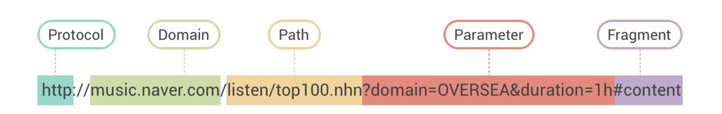

웹 브라우저는 웹 표준과 밀접한 관계가 있다.


- 브라우저의 기본 구조
    - 브라우저 엔진
    브라우저 엔진은 주된 모든 웹 브라우저의 핵심이 되는 소프트웨어 구성 요소이며, 웹 페이지를 해석하고 화면에 표시하는 데 사용하는 소프트웨어 구성 요소이다.
    HTML, CSS, Javascript와 같은 웹 기술을 이해하고, 이를 기반으로 웹 페이지를 렌더링하는 핵심 역할을 한다.
    일반적으로 자바스크립트 엔진과 렌더링 엔진으로 나뉜다.

    - 자바스크립트 엔진
    주요 자바스크립트 엔진 V8(크롬, 엣지)와 SpiderMonkey(파이어폭스) 그리고 JavaScriptCore(사파리) 등이 있으며 다음과 같은 일을 수행한다.
        - Javascript 코드 실행: 브라우저는 웹 페이지의 동적 기능을 처리하기 위해 Javascript 엔진을 사용한다.
        - 파싱 및 실행: Javascript 소스 코드를 읽고 파싱(구문 분석)하여 AST라는 자료구조로 변환한다.
        - AST: 파서가 생성한 트리 형태의 자료구조이며, 프로그램의 구조를 표한한다. JavaScript 엔진이 코드를 실행할 때 참조하는 기본 구조로 사용된다.
        - 인터프리터: AST를 바탕으로 코드를 바이트 코드로 변환하여 실행한다. 인터프리터는 코드를 기계어로 번역하지 않고, 한 줄씩 읽으면서 실행한다. 이 방식은 실행 속도는 느리지만, 초기 실행 시간은 빠르다는 장점이 있다.
        - JIT 컴파일러: 인터프리터와 함께 동작하며, 실행 도중에 성능이 필요한 부분의 코드를 컴파일하는 기술이다.
        
    - 렌더링 엔진
        1. HTML 파서: 브라우저가 수신한 HTML 문서를 분석하여 DOM(Document Object Mpdel) 트리를 생성한다. HTML 코드를 토큰화하고 트리 구조로 변환하여 각 HTML 요소를 노드로 표현한다. 파서는 이 과정에서 이미지,CSS와 같은 외부 리소스도 같이 처리한다.
        2. DOM 트리: HTML 문서를 트리 구조로 표현한 모델로, 각 HTML 태그는 DOM 트리의 하나의 노드이다. JavaScript가 DOM을 조작할 때 이 구조를 기반으로 동작하며, 렌더링 엔진은 이 트리를 활용해 페이지를 화면에 그린다.
        3. CSS 파서: CSS 파일이나 HTML 내부의  `style`태그를 분석하여 CSSOM 트리를 생성한다.
        
        4. CSSOM 트리:
        CSS 파일에서 파싱된 스타일 정보가 트리구조로 저장된 형태이다.
CSSOM 트리는 DOM 트리와 결합하여 화면에 표시할 요소들의 스타일과 배치를 결정한다.
        
        5. 렌더 트리: DOM 트리와 CSSOM 트리를 결합하여 화면에 표시할 요소들만을 포함한 새로운 트리를 생성한다. 실제로 화면에 표시될 내용만 다루기 때문에 `display: none`과 같은 요소는 렌더 트리에 포함되지 않는다.

        
        6. 레이아웃 단계: 렌더 트리가 구성된 후, 브라우저는 각 요소의 크기와 위치를 계산한다. 이를 레이아웃(리플로우)라고 한다.
이 때 화면 크기에 따라 유동적으로 변화하는 요소들도 같이 계산된다.

        7. 페인팅 단계: 레이아웃이 완료되면 각 요소를 실제 화면에 그리는 단계이다. 요소의 배경색, 글꼴 등 다양한 스타일 속성을 사용하여 페인팅 과정을 수행한다.
        이 단계에서 브라우저는 그려내야 할 모든 픽셀들을 결정한다.

    - 데이터 저장소
    브라우저 데이터 저장소는 웹 애플리케이션이 클라이언트 측에 데이터를 저장하고, 빠르게 접근할 수 있도록 지원하는 다양한 기술과 메커니즘을 포함한다.

    이를 통해 서버와의 통신을 최소화하고, 오프라인 상태에서도 웹 애플리케이션이 작동할 수 있도록 도와준다. 

    브라우저에서 제공하는 주요 데이터 저장소 기술에는 쿠키, 로컬 스토리지, 세션 스토리지 캐시 API 등이 있다.

    1. 쿠키: 쿠키는 사용자의 브라우저에 작은 크기에 텍스트 데이터를 저장하는 기술로, HTTP 요청 시 서버와 함께 전송된다. 주로 사용자 인증 정보, 세션 관리와 같은 웹사이트의 사용자 맞춤형 기능을 제공하기 위해 사용된다.
    쿠키는 일반적으로 최대 4KB의 데이터를  저장할 수 있어, 대량의 데이터를 저장하기에는 적합하지 않음.
    쿠키는 HTTP 요청마다 전송되기 때문에 보안에 민감한 데이터는 쉽게 노출될 수 있으며 이를 해결하기 위해 암호화 또는 `Secure` 옵션을 사용해야함

```javascript 
// 예시코드
app.get('/setcookie', (req, res) => {
  res.cookie('session_id', '123456', {
    httpOnly: true,   // 자바스크립트를 통해 쿠키에 접근하지 못하도록 설정 (보안 강화)
    secure: true,     // HTTPS를 통해서만 쿠키를 전송하도록 설정
    maxAge: 3600000   // 쿠키의 유효 시간 (1시간)
  });
  
  res.send('Secure 쿠키가 설정되었습니다.');
});
```


    2. 로컬 스토리지: 일반적으로 5~10MB의 데이터를 저장할 수 있어 쿠키에 비해 훨씬 많은 데이터를 저장할 수 있음
    브라우저를 닫거나 컴퓨터를 재시작해도 데이터가 사라지지 않기 때문에 장기적인 데이터 저장에 적합하지만. 자바스크립트를 통해 접근 가능하므로 XSS 공격에 취약할 수 있기 때문에 보안에 민감한 데이터를 저장할 때는 주의해야함
    로컬 스토리지는 문자열 형식의 데이터만 저장가능하므로 객체나 복잡한 데이터는 직렬화하여 저장해야함

    3. 세션 스토리지: 브라우저 세션이 유지되는 동안만 데이터를 저장하며, 창이나 탭을 닫으면 데이터가 삭제되므로 세션별로 데이터를 분리할 수 있음
    세션이 종료되면 데이터가 모두 삭제되기 때문에 장기적인 데이터 저장에는 적합하지 않음

    4. 캐시 API: 네트워크가 끊기거나 서버와의 연결이 불안정한 상황일 경우에도 캐시된 리소스를 제공할 수 있어, 오프라인 웹 애플리케이션 구현에 적합하다는 장점이 있음.
    자주 요청되는 리소스나 데이터를 미리 캐시에 저장해두면, 빠르게 로드할 수 있어 사용자 경험을 크게 개선할 수 있음
    브라우저마다 캐시 용량이 다르기 때문에 용량이 가득 차면 브라우저에서 자동으로 삭제할 수 있으며 최신 리소스로 갱신되지 않으면 오래된 데이터를 계속 사용할 수 있어, 문제가 발생할 수 있음

- 브라우저의 동작 방식
    - URL 입력 후 일어나는 과정

    URL 입력 후 일어나는 과정에 대해 정리하기 전에, 
    URL의 구조에 대해 먼저 정리하려고 한다.

    
    

    ```plainText
    프로토콜://사용자정보@호스트:포트/경로?쿼리
    ```

    브라우저는 입력된 URL을 파싱하여 프로토콜(HTTP/HTTPS), 도메인 이름, 포트, 경로와 같은 정보로 분리한다.
    
    브라우저는 로컬 캐시에서 해당 리소스가 이미 저장되어 있는지 확인한다. 만약, 유효한 캐시가 있다면 네트워크 요청을 생략하고 바로 캐시된 데이터를 사용한다.

    브라우저는 설정된 프록시 서버를 통해 요청을 보낼지에 대한 여부를 확인한다. 만약 프록시 서버가 설정되어 있다면, 이후 모든 요청은 프록시 서버를 거쳐 전달된다.

    - DNS 조회: URL에 포함된 도메인 이름을 통해 서버에 접속하려면, 먼저 해당 도메인이 어떤 IP 주소를 가리키는지 알아야한다. 브라우저는 DNS 조회를 수행한다.

        1. 로컬 DNS 캐시 확인: 브라우저는 먼저 로컬 DNS 캐시에 해당 도메인의 IP 주소가 저장되어 있는지 확인한다. DNS 조회는 시간이 걸리기 때문에 캐시된 IP 주소를 사용하면 성능을 향상시킬 수 있다.
        2. 호스트 파일 확인: 로컬에 저장된 hosts 파일에서 도메인에 대한 매핑이 있는지 확인한다.
        3. DNS 서버 확인: 로컬 캐시에 없다면 브라우저는 ISP에서 제공하는 DNS 서버에 도메인 이름을 IP 주소로 변환해 달라고 요청한다. 이 과정에서 DNS 서버는 상위 DNS 서버를 조회할 수 있으며, 최종적으로 해당 도메인의 IP 주소를 반환한다.

        4. IP 주소 반환: DNS 서버는 도메인에 해당하는 IP 주소를 브라우저에 반환하고, 브라우저는 해당 IP 주소를 사용하여 서버와 통신을 시작한다.

    - TCP 연결 설정: DNS 조회를 통해 IP 주소를 얻은 후, 브라우저는 웹 서버와 통신하기 위해 TCP 연결을 설정한다. TCP는 신뢰성 있는 데이터 전송을 위한 프로토콜로, 서버와 클라이언트 간의 데이터 전송이 안전하게 이루어지도록 한다.
        1. 3-way HandShake: TCP 연결은 "3단계 핸드셰이크" 라는 과정을 거친다. 이 과정은 클라이언트와 서버 간의 연결이 올바르게 설정되었는지 확인하는 절차이다.
            - SYN(Synchronize): 클라이언트가 서버에 연결 요청 전송
            - SYN-ACK(Synchronize Acknowledgment): 서버는 클라이언트의 요청을 확인하고 응답
            -ACK(Acknowledgment): 클라이언트는 서버의 응답을 수신했음을 확인하고 연결 완료
        2. TLS 핸드셰이크(HTTPS일 경우): HTTPS로 통신하는 경우, TCP 연결 후 TLS 핸드 셰이크가 추가로 진행됨.
        
    - HTTP/HTTPS 요청 전송: TCP 연결이 성공적으로 설정되면, 브라우저는 웹 서버로 HTTP/HTTPS 요청 전송
        HTTP 요청의 경우 모든 HTTP 요청을 TLS 암호화 채널을 통해 안전하게 전송하하므로 중간에서 데이터가 도청되거나 변조되는 것을 방지할 수 있다.

        서버는 요청을 받은 후, 요청한 자원을 찾아 응답을 생성한다. 서버의 응답도 마찬가지로 HTTP 응답 헤더와 바디로 구성된다.   


- 브라우저 캐시 및 캐싱 전략
    - 브라우저 캐시의 구조
    브라우저 캐시는 사용자가 웹 페이지를 방문할 때 다운로드한 리소스를 로컬에 저장하여, 같은 리소스에 대한 요청이 발생했을 때 서버로부터 다시 다운로드 하는 대신 저장된 파일을 로드하는 기능을 한다. 페이지 로딩 속도를 향상시키고 네트워크 대역폭을 절약하는 데 큰 역할을 한다.

    - 브라우저 캐시의 동작 원리
    브라우저 캐시는 HTTP 헤더의 캐시 관련 지시어를 기반으로 동작한다. 웹 서버는 응답 헤더에 캐시 지시어를 포함하여 캐시를 제어할 수 있다.

    대표적인 캐시 제어 헤더는 다음과 같다.
    
    - Cache-Control: 리소스의 캐시 정책을 정의하는 가장 중요한 헤더
    `max-age`, `no-cache`,`no-store`와 같은 지시어를 통해 캐시 동작을 제어한다.

        - max-age: 리소스가 캐시될 최대 시간을 초 단위로 지정
        - no-cache: 브라우저가 캐시된 리소스를 사용하기 전에 항상 서버에서 유효성 검사를 하도록 지시
        - no-store: 리소스를 절대 캐시하지 않도록 지정
    - Expires: HTTP 1.0에서 사용된 캐시 만료 날짜를 설정하는 헤더, Control의 max-age가 우선시 되며, 브라우저는 해당 시간 이후에 리소스를 다시 요청함
    - ETag: 클라이언트에게 캐시된 리소스가 최신버전인지 확인하기 위해 리소스의 버전을 식별하는 고유의 식별자
    - Last-Modified: 리소스가 마지막으로 수정된 날짜를 나타내며, 브라우저는 `If-Modified-Since` 헤더를 통해 서버에 요청 시 리소스가 변경되는지 확인할 수 있음

    - 브라우저 캐시 저장 위치: 브라우저 캐시는 주로 디스크나 메모리에 저장된다. 메모리 캐시는 빠른 접근이 가능하지만 브라우저를 종료하면 사라진다. 그에 비해 디스크 캐시는 지속적이지만 접근 속도가 느리다는 특징이 있다.

        - 메모리 캐시: 브라우저가 리소스를 메모리에 임시로 저장하여 빠르게 접근한다. 단기적으로 사용하는 리소스에 적합하다.
        - 디스크 캐시: 장기적으로 저장할 수 있으며, 브라우저가 종료된 후에도 유지된다. 비교적 큰 파일이나 자주 변경되지 않는 리소스는 디스크에 저장된다.
    - CDN의 역할

    CDN은 전 세계에 분산된 서버 네트워크를 통해 사용자에게 웹 컨텐츠를 빠르고 효율적으로 전달하는 기술이다.
    웹 페이지, 이미지, 동영상 과 같은 정적 파일을 CDN에 분산 저장하여, 사용자의 요청이 발생할 때 지리적으로 가까운 서버에서 리소스를 제공함으로써 로딩 시간을 줄이고 네트워크 성능을 향상시킨다.

    CDN은 사용자의 요청을 가장 가까운 엣지 서버로 라우팅하여, 웹 서버에 직접 접속하지 않고 컨텐츠를 전달한다. 이 과정에서 CDN은 캐시 기능을 수행하며, 다음과 같은 방식으로 최적화한다.

    CDN은 다음과 같은 이점을 갖고 있다. 
    - 전송 속도 향상: 사용자와 가까운 엣지 서버에서 컨텐츠를 제공하므로 로딩 속도가 크게 개선된다.
    - 트래픽 관리: 원본 서버로의 트래픽을 줄여 웹 서버에 과부하가 발생하는 것을 방지한다.
    - 확장성: 대규모 트래픽 처리에 유연하게 대처할 수 있으며, 특정 지역에서 발생하는 트래픽 폭증에도 안정적인 서비스 제공이 가능하다.
    - 보안 강화: DDoS 공격 방어 및 HTTPS 통신 지원 등을 통해 네트워크 보안을 강화할 수 있다.

    CDN과 브라우저 캐시는 상호 보완적인 역할을 한다. CDN 서버가 리소스를 캐싱하여 가까운 위치에서 제공함과 동시에 브라우저에서도 해당 리소스를 캐시에 저장하여, 다음 요청 시 로컬에서 바로 제공 할 수 있다. 
    이로 인해 전체적인 로딩 속도가 더욱 최적화된다. 
            
- 브라우저 보안과 네트워크
    - SSL/TLS와 HTTPS: SSL(Secure Sockets Layer)와 TLS(Transport Layer Security)는 인터넷 상에서 데이터를 안전하게 전송하기 위한 프로토콜이다. 이 프로토콜은 데이터를 암호화하여 전송 중에 해커가 데이터를 중간에서 가로채더라도 내용을 확인할 수 없도록 한다.
    
    SSL/TLS의 역할은 다음과 같다.
        - 데이터 암호화: 송신자와 수신자 사이의 데이터를 암호화하여 안전하게 전달
        - 데이터 무결성: 전송 중 데이터가 변경되지 않았음을 보장
        - 인증: 서버가 신뢰할 수 있는 곳이라는 것을 보장하기 위해 인증서를 통해 서버의 정당성을 검증
    - CORS와 보안
    CORS는 브라우저 보안 기능 중 하나로, 웹 애플리케이션이 다른 도메인에서 자원을 요청할 수 있도록 허용하는 메커니즘이다. 기본적으로 웹 브라우저는 동일 출처 정책(Same-Origin Policy)에 따라 한 도메인에서 다른 도메인으로부터의 요청을 차단한다. 
    이 정책은 보안 문제를 방지하기 위한 것으로, 악의적인 스크립트가 사용자의 정보를 탈취하거나 변조하는 것을 막기 위해 도입되었다.

        - 동일 출처 정책(Same-Origin Policy): 동일 출처란, URL 프로토콜, 도메인, 포트 번호가 동일한 경우를 의미한다.
        기본적으로 브라우저는 한 출처에서 다른 출처로의 리소스 접근을 차단하지만, CORS를 통해 특정 조건 하에 허용할 수 있다.
        - 프리플라이트 요청(Preflight Request): 클라이언트가 실제 요청 전에 서버에 OPTIONS 요청을 보내서, 서버가 해당 요청을 허용할 지 확인하는 과정이다.
        서버는 응답 헤더에 `Access-Control-Aloow-Origin`과 같은 정보를 포함하여, 어떤 출처의 요청을 허용할 지 결정한다.
        
        CORS 응답 헤더는 다음과 같이 구성되어 있다.
        1. Access-Control-Allow-Origin: 허용된 출처를 나타낸다. *를 사용하면 모든 도메인에서 접근 가능하지만, 보안 문제를 야기할 수 있기 때문에 신중하게 사용해야 함
        2. Access-Control-Aloow-Methods: 허용된 HTTP 메서드(GET, POST, PUT, DELETE)를 명시
        3. Access-Control-Allow-Headers: 요청에서 허용할 수 있는 헤더 정의


* 프론트엔드 옵션 설정 방법
        프론트엔드에서 다른 출처로 API 요청을 보낼 때, `withCredential`옵션을 활성화해야한다.
        ```javascript
            // 프론트엔드에서 인증 정보를 포함하는 요청
            axios.get('https://api.example.com/data', {
                withCredentials: true  // 쿠키 또는 인증 정보를 함께 보냄
            });
        ```


참고
https://medium.com/@pac11.dev/%EB%B8%8C%EB%9D%BC%EC%9A%B0%EC%A0%80%EC%9D%98-%ED%8C%8C%EC%8B%B1%EA%B3%BC-%EB%A0%8C%EB%8D%94%EB%A7%81-376447c6cc18

https://www.google.com/search?q=url+%EA%B5%AC%EC%A1%B0&sca_esv=81b62b241f3359c7&udm=2&biw=958&bih=952&sxsrf=ADLYWIIOS40cvHOgfOcFDtLSSVRLDKu4Fg%3A1728611610978&ei=GoUIZ_S4O8Ofvr0Pm53IqQo&ved=0ahUKEwj0rZuInIWJAxXDj68BHZsOMqUQ4dUDCBA&uact=5&oq=url+%EA%B5%AC%EC%A1%B0&gs_lp=Egxnd3Mtd2l6LXNlcnAiCnVybCDqtazsobAyBRAAGIAEMgYQABgFGB4yBhAAGAUYHjIGEAAYBRgeSPkJUABYgQdwAXgAkAEBmAGPAaAB5QaqAQMxLje4AQPIAQD4AQGYAgagAsMEwgILEAAYgAQYsQMYgwHCAgQQABgemAMAkgcDMS41oAefIA&sclient=gws-wiz-serp#vhid=6loprf-0kG6tLM&vssid=mosaic

