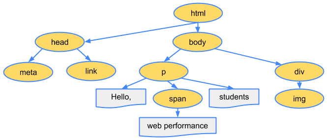
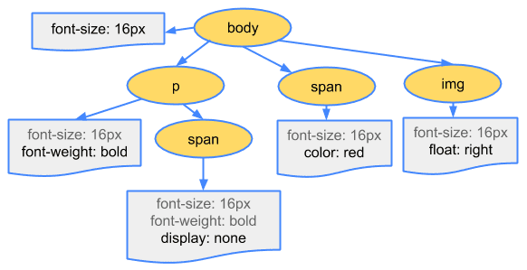
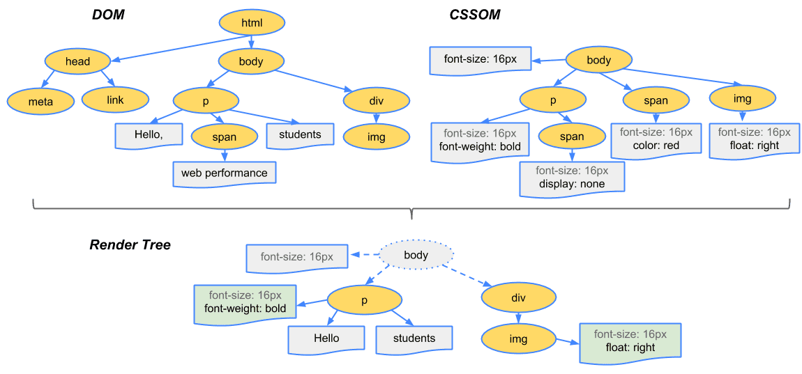

웹 브라우저는 웹 표준과 밀접한 관계가 있다.


- 브라우저의 기본 구조
    - 브라우저 엔진
    브라우저 엔진은 주된 모든 웹 브라우저의 핵심이 되는 소프트웨어 구성 요소이며, 웹 페이지를 해석하고 화면에 표시하는 데 사용하는 소프트웨어 구성 요소이다.
    HTML, CSS, Javascript와 같은 웹 기술을 이해하고, 이를 기반으로 웹 페이지를 렌더링하는 핵심 역할을 한다.
    일반적으로 자바스크립트 엔진과 렌더링 엔진으로 나뉜다.

    - 자바스크립트 엔진
    주요 자바스크립트 엔진 V8(크롬, 엣지)와 SpiderMonkey(파이어폭스) 그리고 JavaScriptCore(사파리) 등이 있으며 다음과 같은 일을 수행한다.
        - Javascript 코드 실행: 브라우저는 웹 페이지의 동적 기능을 처리하기 위해 Javascript 엔진을 사용한다.
        - 파싱 및 실행: Javascript 소스 코드를 읽고 파싱(구문 분석)하여 AST라는 자료구조로 변환한다.
        - AST: 파서가 생성한 트리 형태의 자료구조이며, 프로그램의 구조를 표한한다. JavaScript 엔진이 코드를 실행할 때 참조하는 기본 구조로 사용된다.
        - 인터프리터: AST를 바탕으로 코드를 바이트 코드로 변환하여 실행한다. 인터프리터는 코드를 기계어로 번역하지 않고, 한 줄씩 읽으면서 실행한다. 이 방식은 실행 속도는 느리지만, 초기 실행 시간은 빠르다는 장점이 있다.
        - JIT 컴파일러: 인터프리터와 함께 동작하며, 실행 도중에 성능이 필요한 부분의 코드를 컴파일하는 기술이다.
        
    - 렌더링 엔진
        1. HTML 파서: 브라우저가 수신한 HTML 문서를 분석하여 DOM(Document Object Mpdel) 트리를 생성한다. HTML 코드를 토큰화하고 트리 구조로 변환하여 각 HTML 요소를 노드로 표현한다. 파서는 이 과정에서 이미지,CSS와 같은 외부 리소스도 같이 처리한다.
        2. DOM 트리: HTML 문서를 트리 구조로 표현한 모델로, 각 HTML 태그는 DOM 트리의 하나의 노드이다. JavaScript가 DOM을 조작할 때 이 구조를 기반으로 동작하며, 렌더링 엔진은 이 트리를 활용해 페이지를 화면에 그린다.
        3. CSS 파서: CSS 파일이나 HTML 내부의  `style`태그를 분석하여 CSSOM 트리를 생성한다.
        
        4. CSSOM 트리:
        CSS 파일에서 파싱된 스타일 정보가 트리구조로 저장된 형태이다.
CSSOM 트리는 DOM 트리와 결합하여 화면에 표시할 요소들의 스타일과 배치를 결정한다.
        
        5. 렌더 트리: DOM 트리와 CSSOM 트리를 결합하여 화면에 표시할 요소들만을 포함한 새로운 트리를 생성한다. 실제로 화면에 표시될 내용만 다루기 때문에 `display: none`과 같은 요소는 렌더 트리에 포함되지 않는다.

        
        6. 레이아웃 단계: 렌더 트리가 구성된 후, 브라우저는 각 요소의 크기와 위치를 계산한다. 이를 레이아웃(리플로우)라고 한다.
이 때 화면 크기에 따라 유동적으로 변화하는 요소들도 같이 계산된다.

        7. 페인팅 단계: 레이아웃이 완료되면 각 요소를 실제 화면에 그리는 단계이다. 요소의 배경색, 글꼴 등 다양한 스타일 속성을 사용하여 페인팅 과정을 수행한다.
        이 단계에서 브라우저는 그려내야 할 모든 픽셀들을 결정한다.

    - 데이터 저장소
    브라우저 데이터 저장소는 웹 애플리케이션이 클라이언트 측에 데이터를 저장하고, 빠르게 접근할 수 있도록 지원하는 다양한 기술과 메커니즘을 포함한다.

    이를 통해 서버와의 통신을 최소화하고, 오프라인 상태에서도 웹 애플리케이션이 작동할 수 있도록 도와준다. 

    브라우저에서 제공하는 주요 데이터 저장소 기술에는 쿠키, 로컬 스토리지, 세션 스토리지 캐시 API 등이 있다.

    1. 쿠키: 쿠키는 사용자의 브라우저에 작은 크기에 텍스트 데이터를 저장하는 기술로, HTTP 요청 시 서버와 함께 전송된다. 주로 사용자 인증 정보, 세션 관리와 같은 웹사이트의 사용자 맞춤형 기능을 제공하기 위해 사용된다.
    쿠키는 일반적으로 최대 4KB의 데이터를  저장할 수 있어, 대량의 데이터를 저장하기에는 적합하지 않음.
    쿠키는 HTTP 요청마다 전송되기 때문에 보안에 민감한 데이터는 쉽게 노출될 수 있으며 이를 해결하기 위해 암호화 또는 `Secure` 옵션을 사용해야함

```node 
// 예시코드
app.get('/setcookie', (req, res) => {
  res.cookie('session_id', '123456', {
    httpOnly: true,   // 자바스크립트를 통해 쿠키에 접근하지 못하도록 설정 (보안 강화)
    secure: true,     // HTTPS를 통해서만 쿠키를 전송하도록 설정
    maxAge: 3600000   // 쿠키의 유효 시간 (1시간)
  });
  
  res.send('Secure 쿠키가 설정되었습니다.');
});
```

    2. 로컬 스토리지: 일반적으로 5~10MB의 데이터를 저장할 수 있어 쿠키에 비해 훨씬 많은 데이터를 저장할 수 있음
    브라우저를 닫거나 컴퓨터를 재시작해도 데이터가 사라지지 않기 때문에 장기적인 데이터 저장에 적합하지만. 자바스크립트를 통해 접근 가능하므로 XSS 공격에 취약할 수 있기 때문에 보안에 민감한 데이터를 저장할 때는 주의해야함
    로컬 스토리지는 문자열 형식의 데이터만 저장가능하므로 객체나 복잡한 데이터는 직렬화하여 저장해야함

    3. 세션 스토리지: 브라우저 세션이 유지되는 동안만 데이터를 저장하며, 창이나 탭을 닫으면 데이터가 삭제되므로 세션별로 데이터를 분리할 수 있음
    세션이 종료되면 데이터가 모두 삭제되기 때문에 장기적인 데이터 저장에는 적합하지 않음

    4. 캐시 API: 네트워크가 끊기거나 서버와의 연결이 불안정한 상황일 경우에도 캐시된 리소스를 제공할 수 있어, 오프라인 웹 애플리케이션 구현에 적합하다는 장점이 있음.
    자주 요청되는 리소스나 데이터를 미리 캐시에 저장해두면, 빠르게 로드할 수 있어 사용자 경험을 크게 개선할 수 있음
    브라우저마다 캐시 용량이 다르기 때문에 용량이 가득 차면 브라우저에서 자동으로 삭제할 수 있으며 최신 리소스로 갱신되지 않으면 오래된 데이터를 계속 사용할 수 있어, 문제가 발생할 수 있음

- 브라우저의 동작 방식
    - URL 입력 후 일어나는 과정
    - DNS 조회
    - TCP 연결 설정
    - HTTP/HTTPS 요청 전송

- 브라우저 캐시 및 캐싱 전략
    - 브라우저 캐시의 구조
    브라우저 캐시는 사용자가 웹 페이지를 방문할 때 다운로드한 리소스를 로컬에 저장하여, 같은 리소스에 대한 요청이 발생했을 때 서버로부터 다시 다운로드 하는 대신 저장된 파일을 로드하는 기능을 한다. 페이지 로딩 속도를 향상시키고 네트워크 대역폭을 절약하는 데 큰 역할을 한다.

    - 브라우저 캐시의 동작 원리
    브라우저 캐시는 HTTP 헤더의 캐시 관련 지시어를 기반으로 동작한다. 웹 서버는 응답 헤더에 캐시 지시어를 포함하여 캐시를 제어할 수 있다.

    대표적인 캐시 제어 헤더는 다음과 같다.
    
    - CDN의 역할
            
- 브라우저 보안과 네트워크
    - SSL/TLS와 HTTPS
    - CORS와 보안
